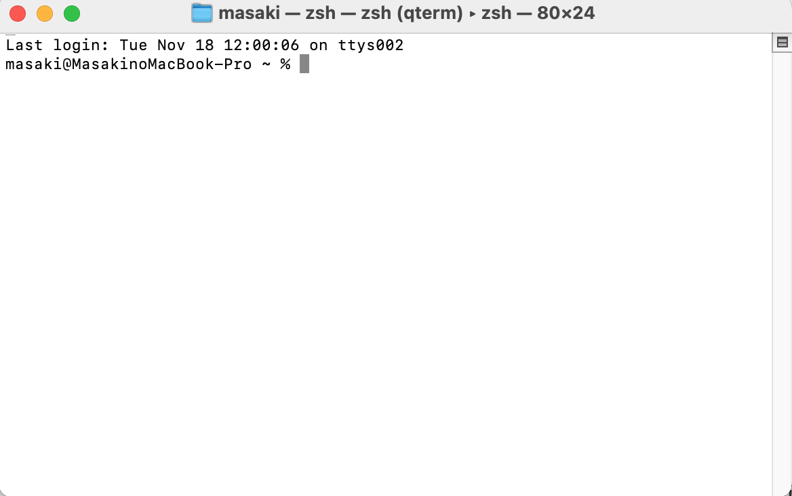
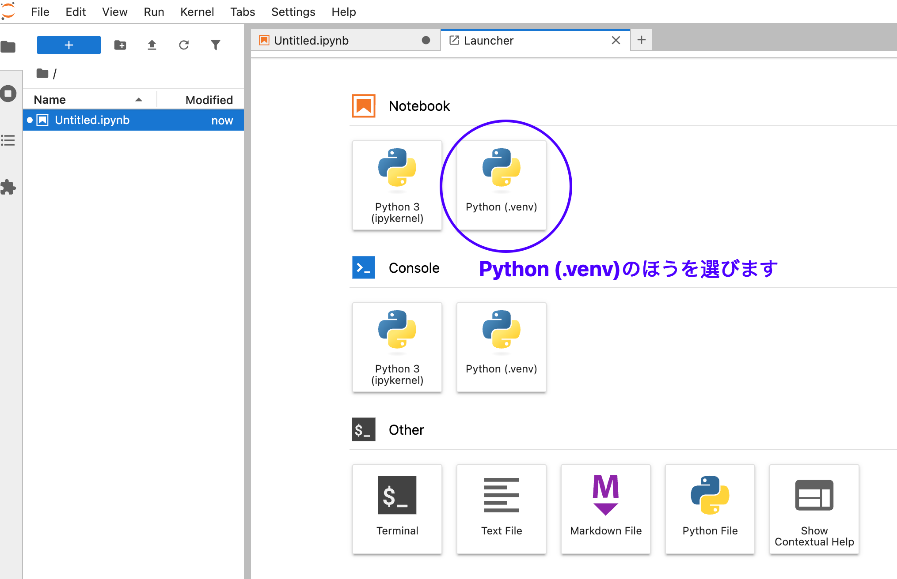

# 演習の目的

本コンテンツは神奈川大学 情報学部 実践的データサイエンス演習受講生向けに作られたページです。

## 演習の概要

Python を使った情報検索の基本的な方法を学習します。Mac OS の環境で Jupyter notebook を使って演習を行います。


## 環境のセットアップ

環境構築には venv を利用します。venv はPythonの仮想環境で、プロジェクトごとに独立した Python 実行環境（今回はこの演習用の環境）を作成することができます。システム全体の Python に影響を与えず、プロジェクト専用の Python とライブラリを管理できます。

まずは Mac のターミナルを開いてください。cmd+space でterminal と打てば検索できると思います。

<kbd> </kbd>

まずは演習用のディレクトリを作成します。名前はなんでも構いませんが情報検索 (Information Retrievall; IR) の文字を取って以下のようにしてみます。

```shell
mkdir ir_project
cd ir_project
```

仮想環境を作ります。利用している環境によっては python は python3 となる場合があります。

```shell
python -m venv .venv
```

仮想環境を有効化します。
```shell
source .venv/bin/activate
```
pip を最新にして必要なライブラリをいれます。以下をコピペして実行しましょう。
**Windows Subsystem for Linux (WSL)を使っている方はこのコマンドを使わず、後述の DISPLAY= が冒頭に入ったコマンドを試してください。**
WSLにissue の報告があります。(['pip install' is extremely slow in WSL2](https://github.com/microsoft/WSL/issues/6643)).

```shell
pip install --upgrade pip
pip install \
    pandas \
    mecab-python3==1.0.10 \
    unidic-lite==1.0.8 \
    rank_bm25==0.2.2 \
    transformers==4.51.0 \
    accelerate \
    "huggingface-hub>=0.30.0,<1.0" \
    --force-reinstall \
    sentence-transformers \
    jupyter \
    jupyterlab \
    ipykernel
python -m ipykernel install --user --name=.venv --display-name "Python (.venv)"
```
WSL2 の場合:
```shell
DISPLAY= pip install --upgrade pip
DISPLAY= pip install \
    pandas \
    mecab-python3==1.0.10 \
    unidic-lite==1.0.8 \
    rank_bm25==0.2.2 \
    transformers==4.51.0 \
    accelerate \
    "huggingface-hub>=0.30.0,<1.0" \
    --force-reinstall \
    sentence-transformers \
    jupyter \
    jupyterlab \
    ipykernel
python -m ipykernel install --user --name=.venv --display-name "Python (.venv)"
```

Jupyter Labを実行します。

```shell
jupyter lab
```

### Jupter Lab での演習

#### 準備
以下はノートブックを作成しながら演習を行います。まず以下をクリックしてノートブックを開きます。

<kbd></kbd>


以下のようにコードをコピーペーストして、▶ボタンを押すか、Ctrl+Enter でコードを実行できます。

<kbd></kbd>

まずは以下のコードを貼り付けて実行します。日本語の wikipedia のデータをダウンロードします。

```python
import pandas as pd
df = pd.read_json("hf://datasets/llm-book/japanese-wikipedia/ja_wiki.jsonl", nrows=1000, lines=True)
```
次のセルに以下のコードを貼り付けると最初の5行のデータを表示することができます。

```python
df.head(5)
```

表示するとわかりますが各行の text という列にテキストデータが入っています。ある行 i のテキストデータは `df.iloc[i]['text']`でアクセス可能です。
もしキーワードが入っているか調べたい場合は `"キーワード" in df.iloc[i]['text']`で調べます。入っていれば True となります。
では、

#### 単純なキーワード一致検索

まずはキーワードの一致で検索してみます。例えば、**京都**というキーワードで検索し、最初の100文字を表示するには以下のような実装ができます（もっと便利な実装はありますが今回は割愛します）
以下では最初の100ドキュメントだけ検索し、一致箇所の前後10文字を取り出します。
```python
offset = 10
for i in range(100):
    query = "京都"
    text = df.iloc[i]["text"]
    if query in text:
        print(f"================記事インデックス{i}================")
        char_index = text.index(query)
        print(text[char_index-offset:char_index+offset])

```

いろいろ結果をみてみると、**東京都**と誤って一致しているケースが見受けられます。

#### 形態素解析の導入

形態素解析をして、東京都と京都を見分けられるようにします。形態素解析MeCabを試してみます。

```python

# 形態素解析の設定
import MeCab
tagger = MeCab.Tagger("-Owakati")

# 試してみる
result=tagger.parse("私は京都に住んでいます")
print(result)
```

形態素の前後にスペースが挿入されていることを確認できます。この`tagger.parse`の処理を先程の検索に入れてみます。結果は変わりましたか？

```python
offset = 10
for i in range(100):
    query = "京都"
    text = df.iloc[i]["text"]
    text = tagger.parse(text) #形態素解析した結果で置き換える
    if query in text:
        print(f"================記事インデックス{i}================")
        char_index = text.index(query)
        print(text[char_index-offset:char_index+offset])
````

#### 類似度検索

講義で説明したように BM25 アルゴリズムで類似度検索ができます。次に以下を実行して、クエリと全文書との類似度を計算し、類似度トップ5の文書を表示します。
途中の query を変更することができます。クエリにあった内容が表示されることを確認しましょう。

```python
from rank_bm25 import BM25Okapi
import MeCab
import numpy as np

# MeCabで分かち書き
tagger = MeCab.Tagger("-Owakati")
tokenized_corpus = [tagger.parse(doc).strip().split() for doc in df["text"]]

# BM25 モデル作成
bm25 = BM25Okapi(tokenized_corpus)

# クエリを分かち書きしてスコア計算
query = "東京　音楽"
tokenized_query = tagger.parse(query).strip().split()
scores = bm25.get_scores(tokenized_query)


# 上位5件のインデックスを取得
top_n = 5
top_indices = np.argsort(scores)[::-1][:top_n]

# 結果表示
print("Top 5 documents:")
for idx in top_indices:
    print(f"======== Doc {idx}: Score = {scores[idx]:.4f} =======")
    print(f"Text = {df.iloc[idx].text[:100]}")
```

BM25を計算するためには、文書中のすべての単語を調べる必要があります。
上記コードの `bm25 = BM25Okapi(tokenized_corpus)` は全文書を渡して、単語の頻度などを調べています。
